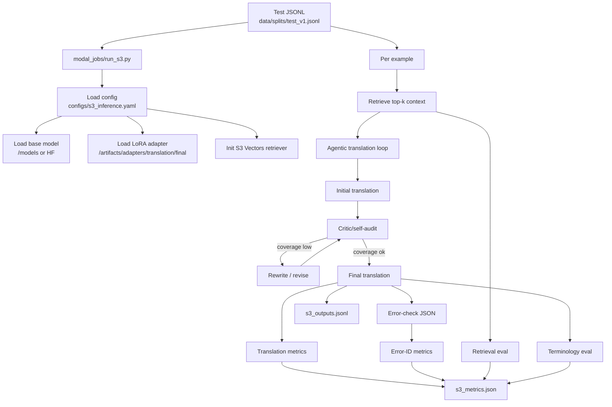

# S3 Agentic RAG Handoff

This document is the focused handoff guide for the `S3` path in this repo:

- `fine-tuned + agentic RAG`
- retrieval from Amazon S3 Vectors
- translation + self-audit + evaluation

Use this file instead of the main `README.md` when the goal is only to run, debug, or extend the `S3` pipeline.

## What S3 Currently Does

The `S3` path runs from [modal_jobs/run_s3.py](modal_jobs/run_s3.py) with config [configs/s3_inference.yaml](configs/s3_inference.yaml).

At a high level it:

1. loads the base Qwen model
2. loads the fine-tuned LoRA adapter if present
3. retrieves context from Amazon S3 Vectors
4. generates a Japanese translation
5. runs a self-audit / rewrite loop
6. runs a structured error-check pass
7. writes predictions and metrics

## Architecture Diagram




## Important Files

- Entry point: [modal_jobs/run_s3.py](modal_jobs/run_s3.py)
- Agent loop: [src/agents/agentic_rag.py](src/agents/agentic_rag.py)
- Retrieval: [src/retrieval/s3_vectors_rag.py](src/retrieval/s3_vectors_rag.py)
- Evaluation helpers: [src/eval/s3_eval.py](src/eval/s3_eval.py)
- Prompts: [src/prompts/s3_prompts.py](src/prompts/s3_prompts.py)
- S3 config: [configs/s3_inference.yaml](configs/s3_inference.yaml)
- Data split generator:
  - simple: [scripts/build_kb_splits.py](scripts/build_kb_splits.py)
  - more realistic: [scripts/build_realistic_kb_splits.py](scripts/build_realistic_kb_splits.py)
- KB assets:
  - [kb/glossary.csv](kb/glossary.csv)
  - [kb/translation_memory.jsonl](kb/translation_memory.jsonl)
  - [kb/annotations_raw.jsonl](kb/annotations_raw.jsonl)
  - [kb/gemini_annotated_results.jsonl](kb/gemini_annotated_results.jsonl)
  - [kb/eng-jap.tsv](kb/eng-jap.tsv)

## Current Inputs and Outputs

### Input

The current config expects:

- `data/splits/test_v1.jsonl`

Each row should look like:

```json
{
  "id": "annot-12345_67890",
  "source_en": "Please update your password.",
  "target_ja": "パスワードを更新してください。",
  "domain": "general",
  "source_ref": "annotations_raw.jsonl",
  "quality_score": 0.95,
  "license": "unknown",
  "split": "test",
  "group_key": "please update your password."
}
```

### Output

`run_s3` writes:

- `results/metrics/s3_outputs.jsonl`
- `results/metrics/s3_metrics.json`

These live in the `enja-results` Modal volume.

## Prerequisites

You need:

- Modal CLI authenticated
- `HF_TOKEN`
- `VECTORS_AWS_ACCESS_KEY_ID`
- `VECTORS_AWS_SECRET_ACCESS_KEY`
- `VECTORS_AWS_DEFAULT_REGION`

PowerShell setup:

```powershell
.\venv\Scripts\python.exe -m pip install -e .
.\venv\Scripts\modal.exe secret create enja-hf --from-dotenv .env --env dev --force
.\venv\Scripts\modal.exe secret create enja-s3-vectors --from-dotenv .env --env dev --force
```

Create volumes if needed:

```powershell
.\venv\Scripts\modal.exe volume create enja-base-models --env dev
.\venv\Scripts\modal.exe volume create enja-model-artifacts --env dev
.\venv\Scripts\modal.exe volume create enja-data --env dev
.\venv\Scripts\modal.exe volume create enja-results --env dev
```

## Recommended Run Sequence

### 1. Generate realistic train/dev/test splits

```powershell
.\venv\Scripts\python.exe -m scripts.build_realistic_kb_splits --train-count 2000 --dev-count 250 --test-count 250
```

This creates:

- `data/splits/train_v1.jsonl`
- `data/splits/dev_v1.jsonl`
- `data/splits/test_v1.jsonl`

### 2. Upload splits to Modal

```powershell
.\venv\Scripts\modal.exe volume put enja-data .\data\splits\train_v1.jsonl /data/splits/train_v1.jsonl --env dev --force
.\venv\Scripts\modal.exe volume put enja-data .\data\splits\dev_v1.jsonl /data/splits/dev_v1.jsonl --env dev --force
.\venv\Scripts\modal.exe volume put enja-data .\data\splits\test_v1.jsonl /data/splits/test_v1.jsonl --env dev --force
```

### 3. Make sure the base model is available

Option A: store it in Modal volume:

```powershell
.\venv\Scripts\modal.exe run -m modal_jobs.download_qwen --repo-id Qwen/Qwen2.5-7B-Instruct --env dev --timestamps
```

Option B: let `run_s3` pull it from Hugging Face using `HF_TOKEN`.

### 4. Train the translation adapter

```powershell
.\venv\Scripts\modal.exe run -m modal_jobs.train_translation --config configs/finetune_translation.yaml --env dev --timestamps
```

Check that the adapter exists:

```powershell
.\venv\Scripts\modal.exe volume ls enja-model-artifacts /adapters/translation/final --env dev
```

### 5. Run S3 inference

```powershell
.\venv\Scripts\modal.exe run -m modal_jobs.run_s3 --config configs/s3_inference.yaml --env dev --timestamps
```

### 6. Fetch outputs and metrics

```powershell
.\venv\Scripts\modal.exe volume get enja-results /results/metrics/s3_metrics.json .\results\ --env dev --force
.\venv\Scripts\modal.exe volume get enja-results /results/metrics/s3_outputs.jsonl .\results\ --env dev --force
```

## Current S3 Metrics Implemented

The current `S3` run produces:

- Translation quality:
  - `BLEU`
  - `chrF++`
  - `COMET`
- System:
  - `avg_latency_ms`
  - `avg_retrieval_ms`
- Agent loop:
  - `avg_coverage_score`
  - `total_rewrite_steps`
  - `total_revision_steps`
- Retrieval:
  - `retrieval_hit_at_k`
  - `retrieval_recall_at_k`
- Terminology:
  - `terminology_accuracy`
- Error identification:
  - `error_binary_f1`
  - `error_category_macro_f1`

Per-example outputs also include:

- `retrieval_chunks`
- `retrieval_eval`
- `terminology_eval`
- `error_check`
- `gold_error_label`
- `agent_trace`

## What Is Working Well

As of the latest runs:

- the full `S3` path runs end to end
- translation metrics are now meaningful
- `COMET`, `BLEU`, and `chrF++` are being computed
- terminology evaluation now has non-zero coverage
- retrieval timing is being logged
- the prompt-based error-check pass is running
- retrieval audit now confirms glossary/TM sources can be returned by S3 Vectors
- error-ID gold lookup now canonicalizes row IDs before metric lookup

## Latest Retrieval Updates (April 2026)

Completed changes in this handoff cycle:

1. Retrieval source audit was run locally and verified against S3 Vectors output.
2. Glossary and TM retrieval assets were prepared and uploaded:

- `kb/glossary_chunks.jsonl`
- `kb/translation_memory_chunks.jsonl`
- `kb/glossary_chunks_embedded_full.jsonl`
- `kb/translation_memory_chunks_embedded_full.jsonl`
- `kb/glossary_chunks_embedded_full_vectors.jsonl`
- `kb/translation_memory_chunks_embedded_full_vectors.jsonl`

1. Retrieval evaluation matching was relaxed in `src/eval/s3_eval.py`:

- overlap threshold lowered from `0.6` to `0.4`
- normalized Japanese match added for glossary approved terms

1. Post-upload retrieval output now includes `source_file` hits from:

- `glossary_chunks_embedded_full`
- `translation_memory_chunks_embedded_full`

1. Error-ID lookup alignment was fixed:

- `canonicalize_id` is now imported and used in `modal_jobs/run_s3.py` for gold label lookup
- lookup now uses canonicalized IDs so prefixed test IDs (`annot-*`, `tm-*`, `engjap-*`) align with gold labels

Interpretation:

- Retrieval wiring is active and glossary/TM are now in the indexed corpus.
- Remaining low retrieval metrics are now mostly a coverage/ranking/eval-set issue, not a missing-index issue.

## Latest Error-ID Updates (April 2026)

Resolved findings from recent runs:

1. Root cause of `error_id_eval_samples = 0` was dataset ID-universe mismatch, not the canonicalization helper itself.
2. Main test split IDs were primarily `engjap-*` numeric IDs, while gold error labels in `kb/gemini_annotated_results.jsonl` used compound annotation IDs (for example `41423_204181`).
3. Canonicalization fix in `run_s3.py` is still required and is already applied, but it cannot bridge two different source ID namespaces by itself.
4. Error-ID metrics became evaluable after running with a gold-aligned error-id eval split.

Validated result on the aligned 100-row run:

- `error_id_eval_samples`: `100`
- `error_binary_f1`: `0.2424`
- `error_category_macro_f1`: `0.1071`

Implication:

- Error-ID evaluation pipeline is now functioning when the eval input IDs overlap with the gold label source.

## Remaining Work / Known Issues

These are the main things the team still needs to finish.

### 1. Keep error-ID evaluation on an ID-aligned split

Status:

- canonicalization fix has been applied in code
- aligned run already verified non-zero `error_id_eval_samples`

Recommended next step:

- keep a dedicated error-id eval split sourced from the same ID universe as `kb/gemini_annotated_results.jsonl`
- do not rely on the default `engjap-*` test split for error-id F1 reporting
- report error-id metrics from the aligned split and translation/retrieval metrics from the general test split

### 2. Make retrieval evaluation more faithful to the actual index

Current symptom:

- `retrieval_hit_at_k` and `retrieval_recall_at_k` are now non-zero in recent runs, but remain low

Likely cause (after latest updates):

- the current retrieval metric is still a proxy / heuristic
- glossary/TM are now indexed but remain sparse versus style/grammar corpora
- exact evidence matching is still difficult with chunked retrieval

Recommended next step:

- increase retrieval-sensitive coverage in KB and test examples (see expansion checklist below)
- keep retrieval eval tolerant for chunked evidence and monitor matched kinds distribution

Suggested improvements (prioritized):

1. Increase retrieval `top_k` for eval runs from `5` to `20` (and optionally `30` for A/B).
2. Expand `kb/translation_memory.jsonl` with 100-300 in-domain EN-JA pairs before next benchmark run.
3. Continue expanding `kb/glossary.csv` with high-frequency UI phrases (not only single tokens).
4. Build a retrieval-targeted eval subset where glossary/TM evidence is expected, and track metrics there.
5. Re-run the full ingest chain after each KB update (chunk -> embed -> index/vector export -> upload).

Recommended reporting protocol:

- Report retrieval metrics for at least two settings: `top_k=5` and `top_k=20`.
- Always report `avg_retrieval_ms` alongside `retrieval_hit_at_k` and `retrieval_recall_at_k`.
- Keep error-id F1 on the aligned error-id split, and retrieval/translation metrics on the general split.

Why this matters:

- right now translation quality can improve even if retrieval metrics remain `0.0`, which makes it hard to prove that RAG itself is helping

### 3. Improve glossary coverage

Current state:

- glossary coverage is better than before, but still limited

Recommended next step:

- expand [kb/glossary.csv](kb/glossary.csv) with more domain-relevant, high-value terms
- prefer stable terminology where one approved Japanese form should win over alternatives
- make sure the dev/test split contains a meaningful glossary-sensitive subset
- prioritize phrase-level terms from test data (for example account/settings/security action phrases)

Why this matters:

- terminology accuracy is one of the cleanest ways to show the value of RAG in this project

### 4. Add retrieval corpus cleanup / audit

Recommended next step:

- confirm exactly which sources are in the S3 vector index
- continue periodic verification that glossary and translation memory remain indexed after re-ingest runs
- document indexed source composition by run (date, source files, notes)

Why this matters:

- the kickoff plan assumes glossary + translation memory + style guide + grammar notes are active RAG assets
- if the index does not contain them, retrieval metrics and downstream behavior will not match the intended design

## Expansion Checklist (What Still Needs To Be Expanded)

Prioritized work to improve retrieval metrics from current baseline:

1. Expand translation memory file size (`kb/translation_memory.jsonl`).

- Current state is too small for robust retrieval hit/recall.
- Target: add at least 100-300 high-quality EN-JA pairs in the same domain as eval data.

1. Expand glossary breadth (`kb/glossary.csv`).

- Add high-frequency UI/product/account/security terms.
- Include approved Japanese forms and meaningful forbidden variants.
- Target: add 50-150 high-impact entries first.

1. Expand retrieval-sensitive eval subset (`data/splits/test_v1.jsonl`).

- Add a focused subset where glossary/TM matches should clearly exist.
- This prevents style/grammar-only retrieval from dominating metrics.
- Target: 50-100 retrieval-targeted test rows.

1. Expand retrieval budget for eval runs (`configs/s3_inference.yaml`).

- Increase retrieval `top_k` for evaluation-only runs (for example 20-30).
- Compare metrics with fixed seeds/settings and record before/after.

1. Rebuild/re-embed/re-upload loop after each KB expansion.

- Recreate chunk files for glossary/TM additions.
- Re-embed and re-upload vectors.
- Re-run audit and metrics to confirm impact.

## Indexed Retrieval Sources

The S3 Vectors index `rag-vector-2` in bucket `is469-genai-grp-project` currently contains:


| Source file        | Content               | Indexed? |
| ------------------ | --------------------- | -------- |
| annotations_raw    | Raw EN-JA annotations | No       |
| eng-jap            | Parallel corpus       | No       |
| glossary           | Approved terminology  | Yes      |
| translation_memory | Curated TM examples   | Yes      |


Last audited: 2026-04-01
Last re-indexed: 2026-04-01

### 5. Create a qualitative review set

Status:

- completed for smoke50 outputs
- review artifact generated at `results/qualitative_review.md`

Current summary from smoke50 review:

- terminology_wins: 5
- retrieval_failures: 48
- correctly_caught_errors: 0
- major_mistranslations: 0
- agent_rewrites_helped: 3

Recommended next step:

- manually inspect 20–30 examples from `s3_outputs.jsonl`
- group them by:
  - terminology wins
  - retrieval failures
  - fluency issues
  - major mistranslations
  - cases where rewrite/revision helped

Why this matters:

- this is required by the kickoff doc
- it will also help explain whether agentic RAG is actually adding value over S2

### 6. Run the actual comparison table

Needed comparison chain:

- `S0 -> S1`
- `S1 -> S2`
- `S2 -> S3`

Current status:

- `S3` is the most actively worked path
- the full comparison table is not yet documented in one place

Recommended next step:

- run each variant on the same held-out test set
- store outputs side by side
- summarize in a single experiment table

## Quick Troubleshooting

### Adapter not loaded

If you see:

- `adapter_dir not found: /artifacts/adapters/translation/final`

Then either:

- the adapter has not been trained yet
- or it was not uploaded into the `enja-model-artifacts` Modal volume

### Input file not found

Remember that the code resolves:

- `data/splits/test_v1.jsonl`

inside the mounted data volume, so upload paths must match what `run_s3.py` expects.

### Retrieval is enabled but metrics stay zero

That does not automatically mean retrieval is broken. It may mean:

- the retrieval metric is too strict
- the indexed sources do not match the eval assumptions
- the current test examples are not ideal retrieval targets

### BLEU/chrF/COMET disagree

This is normal.

- `COMET` is the strongest MT metric here
- `BLEU` is still useful but harsh
- `chrF++` is often more forgiving for Japanese

Use all three together.

## Handoff Summary

If the next teammate only has 10 minutes, tell them this:

1. `modal_jobs/run_s3.py` is the entry point.
2. `configs/s3_inference.yaml` controls the run.
3. `data/splits/test_v1.jsonl` is the current eval input.
4. `results/metrics/s3_metrics.json` and `s3_outputs.jsonl` are the main outputs.
5. Translation metrics are working.
6. Terminology evaluation is partially working.
7. Retrieval evaluation still needs better grounding.
8. Error-ID evaluation is fixed on aligned-ID eval data; keep separate split for reliable F1 reporting.

